# Adding an already existing Project to Git

## using Fork Client

- Open Fork
- Open the File Menu
- Click "Init New Repository..."
  - 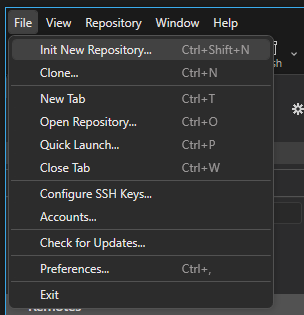
- Now Pick your Unity Project Folder 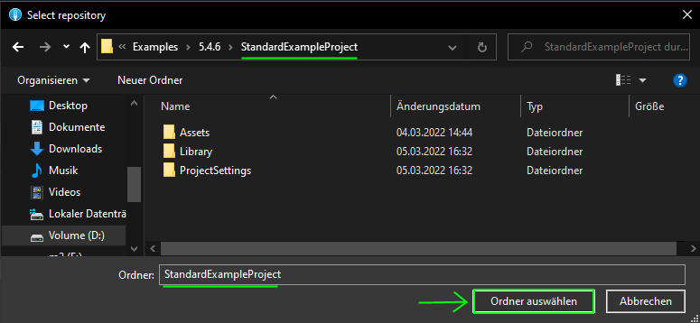
- Go to [https://raw.githubusercontent.com/github/gitignore/main/Unity.gitignore](https://raw.githubusercontent.com/github/gitignore/main/Unity.gitignore)
- rightclick on the text and click "Save to" (Ger: "Speichern Unter") 
- save it in your Project Folder as ".gitignore" 
- INFO: because the .gitignore file is made specifically for unity it musst be saved in the Unity Project Folder, even if it is not the root git folder.
- after the .gitignore file was added, the Library Folder should not be shown in Fork anymore. 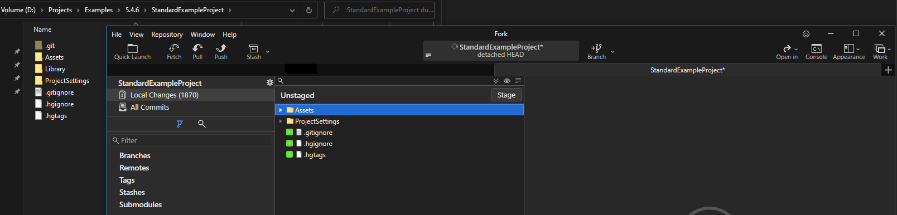
- Now Stage all Files by doing the following:
  - clicking on one of the Files/Folders in Fork
  - press [strg]+[a] on your Keyboard
  - click on the "Stage" Button
- Now all the Files/Folders should be in the Staged Area Below 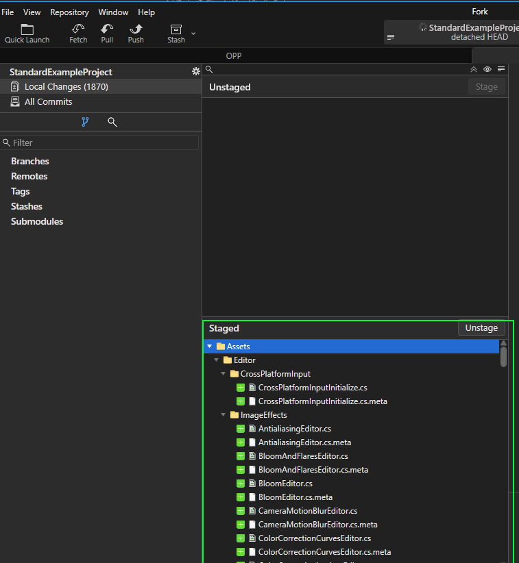
- Add a Commit Description and press "Commit ... Files" 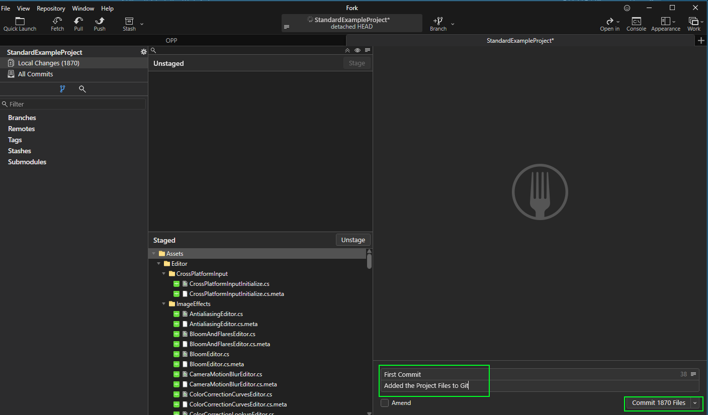
- Now Create an empty Repository on the service you want
- e.g. GitHub: 
  - In the Top Right Click on the + and then on "New Repository"
    - 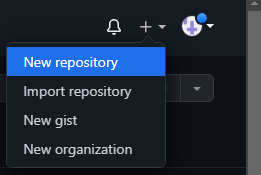
  - then Configure it as empty (No License/Readme/Gitignore) and Click "Create Repository" 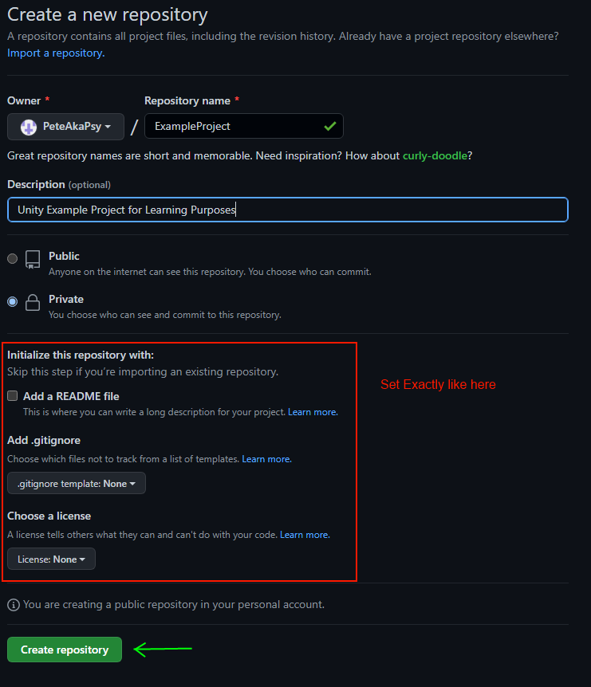
- Now that the Empty Repository is Created, Copy the Repository link 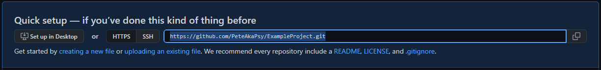
- Go To Fork, Right Click on Remotes and Click on "Add New Remote"
  - 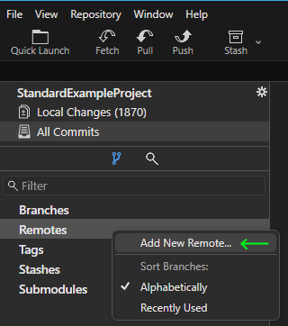
- The Link to your repository should now appear in the new Window, just press the "Add New Remote" Button 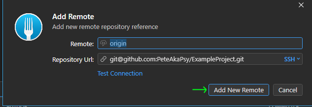
- Now there should be a Remote Called Origin in the Remotes list
  - 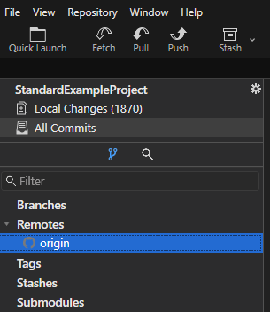
- Now you can Push your local Repository to the service you chose e.g. GitHub
  - Press the "Push" Button on top of the Fork Window
    - 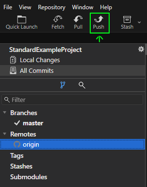
  - in the Push Window, just press Push
    - 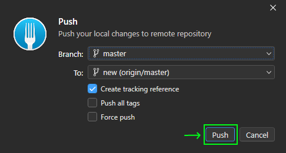
