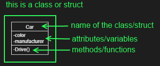
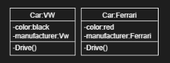
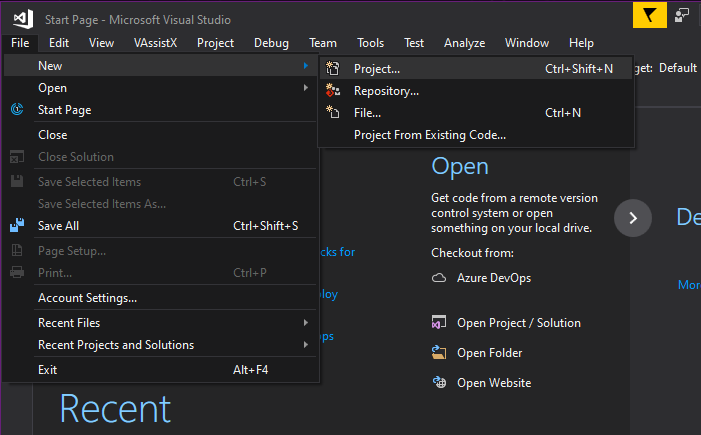
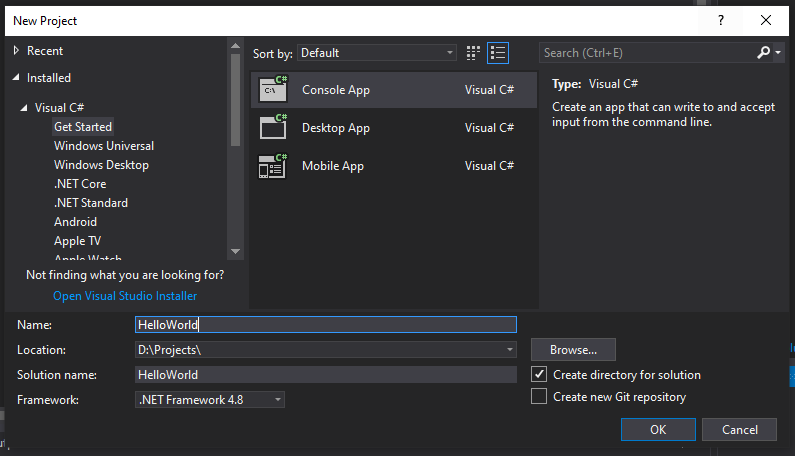

# Programming in C#
## What exactly is Programming
Programming is the Task you do to write an order of instructions to create a Program. In Human Language this would be a list of instructions e.g. like assembly instructions for your Swedish warehouse Furniture. Or telling a Kid how to cross a street safely.
Ok, Lets write down the Crossing the Street example.

### Example: Save Street Crossing for Children
first of all, please mind that this is based on Countries where Cars drive on the Right side, not on the left.
Lets Start with the instructions:
1. when Reaching the Side of the Street do the Following:
   1. Look Right to Check for Cars driving towards you
   2. Look Left to Check for Cars driving towards you
   3. Look Right again to Check for Cars driving towards you
   4. when no Cars are Driving on the Street towards do the Following
      1. walk straigth over the Street to Cross
   5. when there are Cars Driving Towards you do the Following
      1. Repeat the Steps starting on 1.1
2. Finished, you now have Crossed the Street

Now that we Finished that list of Instructions, we have a Program that a Child could use to Cross the Street.


### Exercise add Traffic light instructions
Change the list above to add a Check for Traffic-lights in 50m distance for use.

## What is C#
C# spoken "C Sharp" is an object-oriented programming language that you can use to create Applications that do not have a UI, use the Windows UI or you could use it to create Games in an Engine like Unity. There might be more possibillities, but this should be enought as examples.

### What means object-oriented
Ok, it is an object-oriented Programming(short OOP) language, but what does that mean? Object-oriented means that the Code is done in an Organized way based on the differentiation of Objects.

### The Structure of OOP
The following structures are used in C# and most of the OOP languages
- struct (Structures): user defined Blueprints for individual Objects, attributes and methods, primarily used for composing Data Objects
- class (Classes): user defined Blueprints for individual Objects, attributes and methods, primarily used for composing Functionallity Objects
- objects: are instances of class/struct holding then the actual data and providing the functionallity for this data set
- methods (member functions): provide specific functionallity of an Object
  - allows reusabillity to keep away from writing the same functionallity over and over again
  - allows encapsulation to hide internal repeating functionallity away from visible  functionallity (more later)
- attributes (member variables): are variables holding data or object instances representing relations between Objects

to show you an example what is meant by this above, check this image:


from that class we now create 2 instances to have 2 Objects based on Car, but now we fill it with Data:


if this was not enough to understand, please Read further, as it gets more clear in understanding by actual Programming examples

### Installing Visual Studio
TODO

### Starting with C# / Hello World!
#### Creating a new Project
- Open Visual Studio
- Click File -> New Project
  - 
- on the left side
  - open Installed
  - open Visual C#
  - select "Get Started"
- in the center you should see "Console App","Desktop App" and "Mobile App"
- select "Console App"
- On the Bottom:
  - Change the Location to a Path where the Project should be saved
  - Change the Name and Solution name to "HelloWorld"
- Press the "Ok" Button to create the Project
  - 

#### Writing the Code

```cs
using System;
using System.Collections.Generic;
using System.Linq;
using System.Text;
using System.Threading.Tasks;

namespace HelloWorld
{
	class Program
	{
		static void Main(string[] args)
		{
			// The code provided will print ‘Hello World’ to the console.
			// Press F5 (or Start) to run your app.
			Console.WriteLine("Hello World!");
			Console.ReadKey();
		}
	}
}
```
